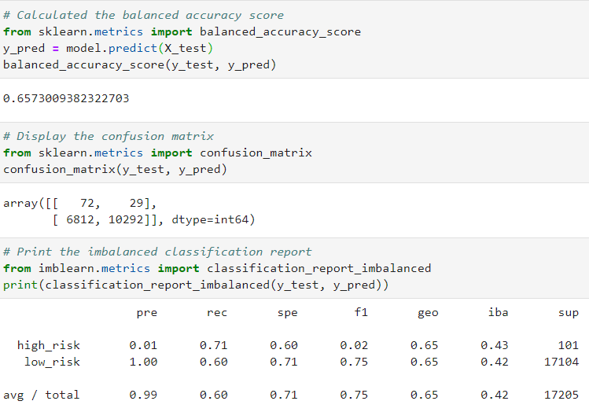
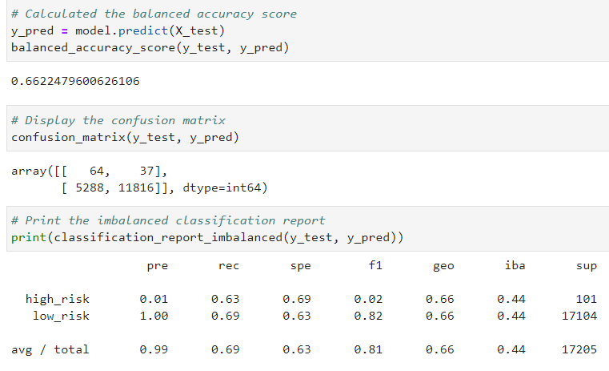
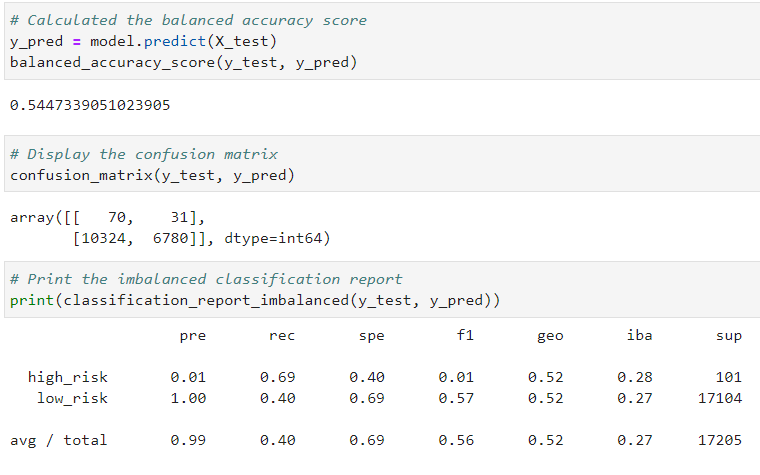
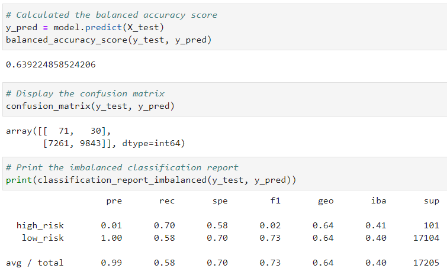
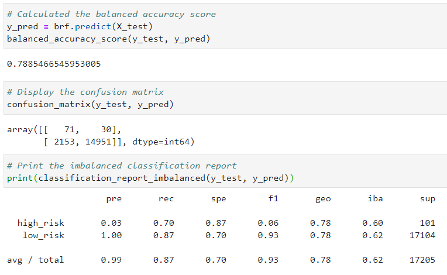
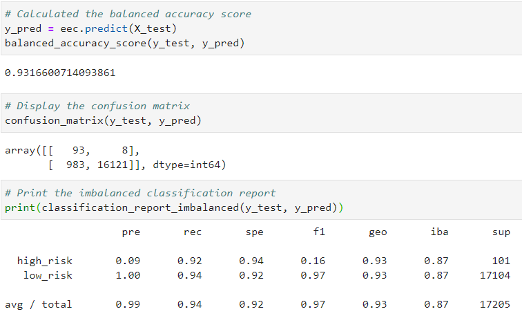

# Credit Risk Analysis
## Overview
### This analysis is designed to examine various supervised machine learning algorithms and evaluate their performance in predicting credit card risk. Using a credit card dataset from LendingClub with unbalanced classes (low-risk greatly outnumbers high-risk loans), oversampling, undersampling, combination sampling, and ensemble learning approaches will be utilized and compared.

## Resources
- Dataset: LoanStats_2019Q1.csv (LendingClub)
- Jupyter lab
- Python libraries
	- pandas
	- numpy
	- pathlib
	- collections
	- sklearn 
	- imbalanced-learn

## Results
### Naive Random Oversampling
- **Balanced accuracy score: 0.657**
- **Precision (high-risk): 0.01**
- **Precision (low-risk): 1.00**
- **Recall (high-risk): 0.71**
- **Recall (low-risk): 0.60**

### SMOTE Oversampling
- **Balanced accuracy score: 0.662**
- **Precision (high-risk): 0.01**
- **Precision (low-risk): 1.00**
- **Recall (high-risk): 0.63**
- **Recall (low-risk): 0.69**

### Cluster Centroid Undersampling
- **Balanced accuracy score: 0.545**
- **Precision (high-risk): 0.01**
- **Precision (low-risk): 1.00**
- **Recall (high-risk): 0.69**
- **Recall (low-risk): 0.40**

### SMOTEENN Combination Sampling
- **Balanced accuracy score: 0.639**
- **Precision (high-risk): 0.01**
- **Precision (low-risk): 1.00**
- **Recall (high-risk): 0.70**
- **Recall (low-risk): 0.58**

### Balanced Random Forest Classifier (Ensemble Learning)
- **Balanced accuracy score: 0.789**
- **Precision (high-risk): 0.03**
- **Precision (low-risk): 1.00**
- **Recall (high-risk): 0.70**
- **Recall (low-risk): 0.87**

### Easy Ensemble AdaBoost classifier (Ensemble Learning)
- **Balanced accuracy score: 0.932**
- **Precision (high-risk): 0.09**
- **Precision (low-risk): 1.00**
- **Recall (high-risk): 0.92**
- **Recall (low-risk): 0.94**

## Summary
### Top Algorithm(s) by Score:

- **Balanced Accuracy Score:** Easy Ensemble AdaBoost Classifier (0.932)
- **Precision (high-risk) Score:** Easy Ensemble AdaBoost Classifier (0.09)
- **Precision (low-risk) Score:** The same among all algorithms (1.00)
- **Recall (high-risk) Score:** Easy Ensemble AdaBoost Classifier (0.92)
- **Recall (low-risk) Score:** Easy Ensemble AdaBoost Classifier (0.94)

The Easy Ensemble AdaBoost Classifier algorithm has the best accuracy, precision, and recall scores of the six machine learning algorithms. This Easy Ensemble classifier only mis-predicted 8 of the 101 high-risk loans to be low-risk (8 false negatives), compared to the roughly 30 false negatives of the other algorithms. The Easy Ensemble classifier also had relatively minimal mislabeling of low-risk loans as high-risk (983 false positives) compared to the other algorithms (2153-10324 false positives).

Given the better objective and relative performance, the **Easy Ensemble AdaBoost Classifier** is the recommended model to use in predicting credit risk. 
